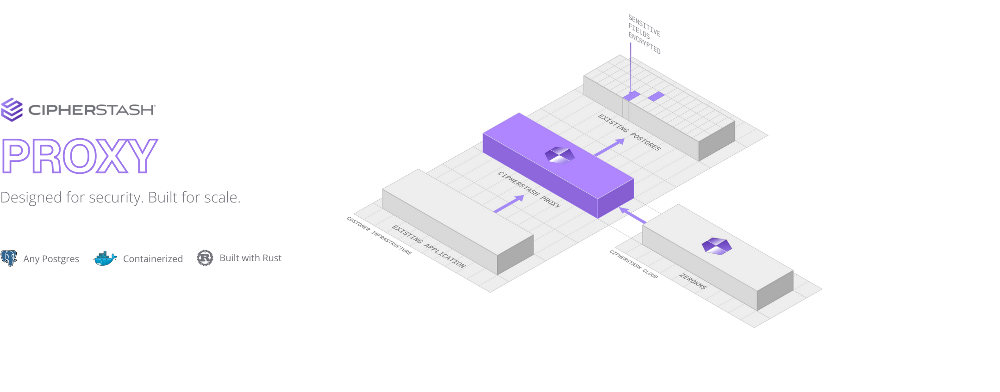

<picture>
  <source media="(prefers-color-scheme: dark)" srcset="./docs/images/index-dark.png">
  
</picture>

   
  

    
    
  

   
  

    <a href="https://cipherstash.com/docs/devops/proxy">Documentation</a> | <a href="https://cipherstash.com/support">Support</a> | <a href="https://cipherstash.com">CipherStash</a>
  

<!-- start -->

# CipherStash Proxy

CipherStash Proxy provides transparent, *searchable* encryption for your existing Postgres database.

## Field level encryption

## SQL via searchable encryption

## Cryptographic multi-tenancy

* Automatically encrypts and decrypts data with zero changes to SQL
* Supports queries over *encrypted* values:
   - equality
   - comparison
   - ordering
   - grouping

## Performance

## Documentation

For full documentation visit [cipherstash.com/docs][docs]

## How it works

TODO: Show a diagram
Explain that proxy runs inside your infrastructure.
ZeroKMS is used for key management, never sees your keys and is 14x faster than KMS (link to Read more).

* Is written in Rust for high performance and strongly-typed mapping of SQL statements.
* Manages keys using CipherStash ZeroKMS, offering up to 14x the performance of AWS KMS

Behind the scenes, CipherStash Proxy uses the [Encrypt Query Language](https://github.com/cipherstash/encrypt-query-language/) to index and search encrypted data.

## Alternatives

[docs]: https://cipherstash.com/docs