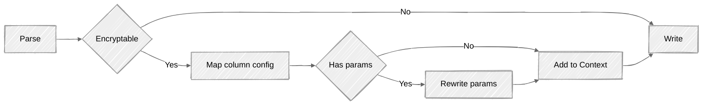
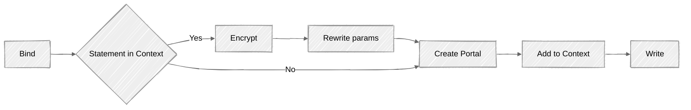

## Message Handling Flow Diagrams

### Parse

```mermaid
---
config:
  look: handDrawn
  theme: neutral
---
flowchart LR
        Parse --> P_Encryptable{Encryptable}
        P_Encryptable -->|Yes| P_MapConfig[Map column config]
        P_MapConfig --> P_Params{Has params}
        P_Encryptable -->|No| P_Write[Write]
        P_Params -->|Yes| P_RewriteParams[Rewrite params]
        P_Params -->|No| P_AddContext[Add to Context]
        P_RewriteParams --> P_AddContext
        P_AddContext --> P_Write

```

### Bind

```mermaid
---
config:
  look: handDrawn
  theme: neutral
---
flowchart LR
    Bind --> B_Context{Statement in Context}
    B_Context -->|Yes| B_Encrypt[Encrypt]
    B_Encrypt[Encrypt] --> B_RewriteParams[Rewrite params]
    B_RewriteParams --> B_Portal[Create Portal]
    B_Portal --> B_AddContext[Add to Context]
    B_Context -->|No| B_Portal
    B_AddContext --> B_Write[Write]

```