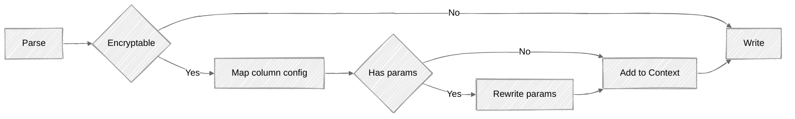
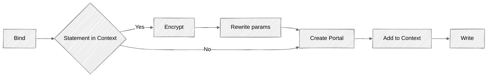

# Message Handling Flow Diagrams

Below are the flow diagrams for the message handling in CipherStash Proxy for PostgreSQL requests.

### Parse




### Bind





### Pipelining

Pipelining allows the client and server sides of the connection to work concurrently.
The Client sends messages without waiting for responses from the Server.
The proxy needs to keep track of Describe and Execute messages in order to know which statement or portal server messages correlate to.

The PostgreSQL server executes the queries sequentially.


```
            Sequential                              Pipelined
| Client         | Server          |    | Client         | Server          |
|----------------|-----------------|    |----------------|-----------------|
| send query 1   |                 |    | send query 1   |                 |
|                | process query 1 |    | send query 2   | process query 1 |
| receive rows 1 |                 |    | send query 3   | process query 2 |
| send query 2   |                 |    | receive rows 1 | process query 3 |
|                | process query 2 |    | receive rows 2 |                 |
| receive rows 2 |                 |    | receive rows 3 |                 |
| send query 3   |                 |
|                | process query 3 |
| receive rows 3 |                 |
```