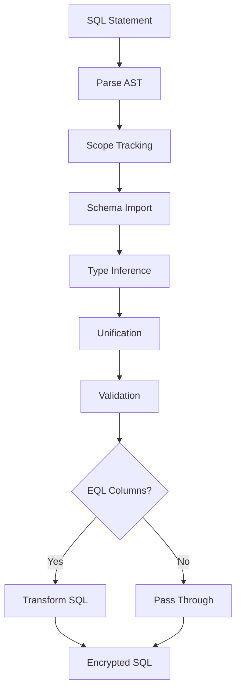

# EQL-Mapper Onboarding Guide

Welcome to the EQL-Mapper package! This document provides a comprehensive overview of the eql-mapper system - the core SQL transformation layer that enables CipherStash Proxy to safely transform SQL queries to work with encrypted data.

## What is EQL-Mapper?

EQL-Mapper is a sophisticated SQL transformation engine that:
- **Analyzes SQL statements** using advanced type inference and unification algorithms
- **Validates operations** on encrypted columns to ensure they're cryptographically sound
- **Transforms SQL queries** to work with encrypted data while preserving original semantics
- **Maintains type safety** throughout the transformation process

Think of it as a "smart compiler" for SQL that understands both regular PostgreSQL types and encrypted (EQL) types.

## Table of Contents

1. [Architecture Overview](#architecture-overview)
2. [Core Components](#core-components)
3. [How EQL-Mapper Works](#how-eql-mapper-works)
4. [EQL Type System](#eql-type-system)
5. [Key Algorithms](#key-algorithms)
6. [Package Structure](#package-structure)
7. [Common Use Cases](#common-use-cases)
8. [Development Guide](#development-guide)
9. [Testing](#testing)
10. [Troubleshooting](#troubleshooting)
11. [External Resources](#external-resources)

## Architecture Overview

EQL-Mapper uses a **visitor pattern** architecture with multiple coordinated components:

```
┌─────────────────────────────────────────────────────────────┐
│                      EQL-Mapper                            │
├─────────────────────────────────────────────────────────────┤
│  ┌─────────────┐  ┌─────────────┐  ┌─────────────┐         │
│  │ScopeTracker │  │  Importer   │  │TypeInferencer│         │
│  └─────────────┘  └─────────────┘  └─────────────┘         │
│           │               │               │                 │
│           └───────────────┼───────────────┘                 │
│                           │                                 │
│  ┌─────────────┐  ┌─────────────┐  ┌─────────────┐         │
│  │TypeRegistry │  │  Unifier    │  │TableResolver│         │
│  └─────────────┘  └─────────────┘  └─────────────┘         │
└─────────────────────────────────────────────────────────────┘
```

## Core Components

### 1. **ScopeTracker**
- **Purpose**: Manages lexical scoping for SQL identifiers
- **Location**: `src/scope_tracker.rs`
- **Key responsibility**: Tracks table aliases, column references, and nested query scopes

### 2. **Importer**
- **Purpose**: Imports table and column definitions from the database schema
- **Location**: `src/importer.rs`
- **Key responsibility**: Resolves table names to schema definitions and identifies EQL columns

### 3. **TypeInferencer**
- **Purpose**: Performs type inference on SQL AST nodes
- **Location**: `src/inference/`
- **Key responsibility**: Assigns types to expressions, validates operations, generates constraints

### 4. **Unifier**
- **Purpose**: Solves type equations and unifies types
- **Location**: Uses external `unifier` crate
- **Key responsibility**: Resolves type variables, checks trait bounds, handles associated types

### 5. **TypeRegistry**
- **Purpose**: Maps AST nodes to their inferred types
- **Location**: `src/inference/type_registry.rs`
- **Key responsibility**: Stores and retrieves type information for AST nodes

### 6. **TableResolver**
- **Purpose**: Provides access to database schema information
- **Location**: `src/model/table_resolver.rs`
- **Key responsibility**: Abstracts schema access (fixed vs. editable schemas)

## How EQL-Mapper Works

### The Complete Flow



### Step-by-Step Process

1. **Parsing**: SQL statement is parsed into an AST by the `sqltk` parser
2. **Scope Tracking**: Track table aliases and column references across nested scopes
3. **Schema Import**: Resolve table names and import column definitions (including EQL metadata)
4. **Type Inference**: Visit each AST node and infer its type using constraint generation
5. **Unification**: Solve type equations and assign concrete types to all expressions
6. **Validation**: Ensure all operations on EQL columns are cryptographically valid
7. **Transformation**: If EQL columns are involved, rewrite SQL for encrypted execution

### Example Transformation

**Input SQL:**
```sql
SELECT email FROM users WHERE email = 'alice@example.com'
```

**Schema:**
```rust
users: {
    id,           // Native column
    email (EQL),  // Encrypted column
    name,         // Native column
}
```

**Type Inference Results:**
- `users.email` → `EqlValue(users.email, EqlTraits::default())`
- `'alice@example.com'` → `EqlValue(users.email, EqlTraits::default())` (unified with column)
- Projection → `[(EQL(users.email) as email)]`

**Transformed SQL:**
```sql
SELECT email FROM users WHERE email = 'ENCRYPTED_PAYLOAD'::JSONB::eql_v2_encrypted
```

## EQL Type System

### Core Types

```rust
pub enum Value {
    Eql(EqlTerm),           // Encrypted values
    Native(NativeValue),    // PostgreSQL native types
    Array(Array),           // Array types
    Projection(Projection), // Result set projections
    SetOf(SetOf),          // Set-returning functions
}
```

### EQL Terms

EQL terms represent different forms of encrypted data:

```rust
pub enum EqlTermVariant {
    Full,           // Complete EQL payload (for INSERT/storage)
    Partial,        // EQL with trait bounds (for WHERE clauses)
    JsonAccessor,   // JSON field access (column->field)
    JsonPath,       // JSON path queries (jsonb_path_query)
    Tokenized,      // Tokenized text (for pattern matching)
}
```

### EQL Traits

EQL traits define what operations are supported on encrypted columns:

- **`Eq`**: Equality comparisons (`=`, `!=`)
- **`Ord`**: Ordering operations (`<`, `>`, `BETWEEN`)
- **`TokenMatch`**: Text pattern matching (`LIKE`, `ILIKE`)
- **`JsonLike`**: JSON operations (`->`, `->>`, `jsonb_path_query`)
- **`Contain`**: Containment operations (`@>`, `<@`)

### Schema Definition Example

```rust
schema! {
    tables: {
        users: {
            id,                           // Native column
            email (EQL: Eq),             // Encrypted, supports equality
            salary (EQL: Ord),           // Encrypted, supports ordering
            notes (EQL: JsonLike),       // Encrypted JSON data
            tags (EQL: Contain),         // Encrypted, supports containment
        }
    }
}
```

## Key Algorithms

### Type Inference Algorithm

The type inference engine uses **bidirectional type checking** with constraint generation:

1. **Bottom-up traversal**: Child nodes are typed before parents
2. **Constraint generation**: Each node generates type equations
3. **Incremental unification**: Types are refined as more constraints are discovered
4. **Trait bound checking**: Ensures EQL types support required operations

### Unification Algorithm

The unifier implements a **Hindley-Milner style unification algorithm**:

1. **Structural unification**: Handles complex types (projections, arrays)
2. **Type variable resolution**: Replaces unknowns with concrete types
3. **Associated type resolution**: Handles trait-specific type relationships
4. **Bounds satisfaction**: Ensures EQL types meet operation requirements

### Transformation Strategy

The transformation system uses **modular rule-based rewriting**:

1. **Dry run validation**: Check if transformation is needed
2. **Rule composition**: Multiple transformation rules work together
3. **Node-based replacement**: Preserve SQL structure while changing specific nodes
4. **Alias preservation**: Maintain column aliases through transformation

## Package Structure

```
eql-mapper/
├── src/
│   ├── lib.rs                    # Main library interface and tests
│   ├── eql_mapper.rs            # Core EqlMapper implementation
│   ├── inference/               # Type inference system
│   │   ├── mod.rs
│   │   ├── infer_type.rs        # Main type inference logic
│   │   ├── infer_type_impls/    # Node-specific inference implementations
│   │   ├── unifier/             # Type unification system
│   │   └── sql_types/           # SQL type definitions
│   ├── model/                   # Schema and table models
│   │   ├── mod.rs
│   │   ├── schema.rs            # Schema definitions
│   │   ├── table.rs             # Table representations
│   │   └── table_resolver.rs    # Schema access strategies
│   ├── transformation_rules/    # SQL rewriting rules
│   │   ├── mod.rs
│   │   └── [various rule implementations]
│   └── [other modules]
└── Cargo.toml
```

### eql-mapper-macros/
Companion procedural macro package providing:
- `trace_infer`: Tracing instrumentation
- `binary_operators`: Binary operator parsing
- `functions`: Function declaration parsing
- `ty`, `concrete_ty`: Type construction macros
- `tvar`: Type variable creation
- `type_env`: Type environment construction

## Common Use Cases

### 1. Simple SELECT with EQL Column
```sql
SELECT email FROM users WHERE email = 'alice@example.com'
```
**Type inference**: Literal gets unified with column type, becomes encrypted

### 2. JOIN with Mixed Column Types
```sql
SELECT u.email, p.title
FROM users u
JOIN posts p ON u.id = p.user_id
WHERE u.email = 'alice@example.com'
```
**Type inference**: Only `u.email` operations are encrypted, `p.title` remains native

### 3. Aggregate Functions on EQL Columns
```sql
SELECT department, MIN(salary), MAX(salary)
FROM employees
GROUP BY department
```
**Transformation**: `MIN(salary)` becomes `eql_v2.min(salary)`

### 4. JSON Operations on EQL Columns
```sql
SELECT jsonb_path_query(notes, '$.medications')
FROM patients
```
**Transformation**: Function and path selector both get encrypted

### 5. Complex Subqueries
```sql
SELECT * FROM (
    SELECT email, salary FROM users WHERE salary > 50000
) WHERE email = 'alice@example.com'
```
**Type inference**: Handles nested scopes and propagates EQL types correctly

## Development Guide

### Setting Up Development Environment

1. **Install Rust**: Latest stable version
2. **Clone repository**: Get the CipherStash Proxy codebase
3. **Install dependencies**: `cargo build` in the eql-mapper directory
4. **Run tests**: `cargo test`

### Key Development Patterns

#### Adding Support for New SQL Constructs

1. **Add AST support**: Ensure `sqltk` parser handles the construct
2. **Implement InferType**: Add type inference logic in `inference/infer_type_impls/`
3. **Add transformation rules**: If needed, add rules in `transformation_rules/`
4. **Write tests**: Add comprehensive test cases in `lib.rs`

#### Adding New EQL Traits

1. **Define trait**: Add to the `unifier` crate
2. **Update schema macros**: Support new trait in schema definitions
3. **Add inference rules**: Handle new trait in type inference
4. **Add transformation rules**: Handle new operations in SQL rewriting

#### Debugging Type Inference Issues

1. **Enable tracing**: Use `init_tracing()` in tests
2. **Check constraint generation**: Verify type equations are correct
3. **Inspect unification**: Use `dump_all_nodes()` and `dump_substitutions()`
4. **Test incrementally**: Start with simple cases and build complexity

### Code Organization Principles

- **Separation of concerns**: Each component has a single responsibility
- **Visitor pattern**: Consistent traversal across all components
- **Type safety**: Extensive use of Rust's type system
- **Error handling**: Comprehensive error types with context
- **Testing**: Extensive test coverage with property-based testing

## Testing

### Test Structure

The main test suite is located in `src/lib.rs` and includes:

- **Basic type inference tests**: Simple SELECT statements
- **Complex query tests**: JOINs, subqueries, CTEs, window functions
- **EQL operation tests**: All supported EQL traits and operations
- **Transformation tests**: Verify correct SQL rewriting
- **Error condition tests**: Invalid operations and type mismatches

### Running Tests

```bash
# Run all tests
cargo test

# Run specific test
cargo test basic_with_value

# Run with tracing (for debugging)
cargo test -- --nocapture
```

### Test Patterns

```rust
#[test]
fn test_name() {
    let schema = resolver(schema! {
        tables: {
            users: {
                id,
                email (EQL: Eq),
                name,
            }
        }
    });

    let statement = parse("SELECT email FROM users WHERE email = $1");

    match type_check(schema, &statement) {
        Ok(typed) => {
            // Assert expected types
            assert_eq!(typed.projection, expected_projection);
            assert_eq!(typed.params, expected_params);
        }
        Err(err) => panic!("type check failed: {err}"),
    }
}
```

### Test Utilities

- **`schema!` macro**: Create test schemas easily
- **`parse()` function**: Parse SQL strings into AST
- **`type_check()` function**: Main entry point for type checking
- **`projection!` macro**: Create expected projection types
- **`concrete_ty!` macro**: Create concrete types for assertions

## Troubleshooting

### Common Issues

#### Type Inference Failures

**Symptom**: `TypeError` during type checking
**Causes**:
- Unsupported operation on EQL column
- Missing schema definition
- Type unification failure

**Debug steps**:
1. Enable tracing to see constraint generation
2. Check that schema includes all referenced tables/columns
3. Verify that EQL column has required traits for operations

#### Transformation Failures

**Symptom**: `TransformError` during SQL rewriting
**Causes**:
- Placeholder parameter changes
- Missing transformation rule
- Invalid encrypted literal replacement

**Debug steps**:
1. Check that transformation rules are properly composed
2. Verify that encrypted literals are provided correctly
3. Test transformation with dry run first

#### Unification Failures

**Symptom**: Unable to unify types
**Causes**:
- Conflicting type constraints
- Missing trait bounds
- Invalid associated type usage

**Debug steps**:
1. Use `dump_substitutions()` to inspect unifier state
2. Check for conflicting type equations
3. Verify trait bounds are satisfied

### Performance Considerations

- **Complex queries**: May require significant processing time
- **Large schemas**: Import time scales with schema size
- **Deep nesting**: Subqueries add complexity to type inference

### Debugging Tools

- **Tracing**: Comprehensive logging throughout the system
- **Type dumps**: Inspect inferred types and constraints
- **AST visualization**: Understand query structure
- **Test isolation**: Run individual tests to isolate issues

## Best Practices

1. **Start simple**: Begin with basic queries before attempting complex ones
2. **Use tracing**: Enable logging for debugging type inference issues
3. **Write tests**: Add test cases for new functionality
4. **Check schemas**: Ensure database schemas are correctly defined
5. **Understand EQL**: Learn the capabilities and limitations of each EQL trait
6. **Monitor performance**: Be aware of computational complexity for large queries

## Getting Help

- **Internal documentation**: Check inline code comments and documentation
- **Test cases**: Look at existing tests for examples
- **Team members**: Reach out to the EQL-Mapper team for guidance
- **Error messages**: Read error messages carefully - they often contain helpful hints

## External Resources

### PostgreSQL Documentation
- **[PostgreSQL SQL Syntax Reference](https://www.postgresql.org/docs/current/sql.html)** - Complete SQL command reference
- **[PostgreSQL Data Types](https://www.postgresql.org/docs/current/datatype.html)** - Understanding PostgreSQL's type system
- **[PostgreSQL JSON Functions](https://www.postgresql.org/docs/current/functions-json.html)** - JSONB operations that EQL-Mapper supports
- **[PostgreSQL Aggregate Functions](https://www.postgresql.org/docs/current/functions-aggregate.html)** - Built-in aggregation functions

### Type Theory and Unification
- **[Hindley-Milner Type System](https://en.wikipedia.org/wiki/Hindley%E2%80%93Milner_type_system)** - Foundation of EQL-Mapper's type inference
- **[Algorithm W](https://en.wikipedia.org/wiki/Algorithm_W)** - Classic type inference algorithm
- **[Type Unification Algorithm](https://en.wikipedia.org/wiki/Unification_(computer_science))** - Core algorithm used in type checking

### Rust-Specific Resources
- **[Visitor Pattern in Rust](https://rust-unofficial.github.io/patterns/patterns/behavioural/visitor.html)** - Pattern used throughout EQL-Mapper
- **[Rust Error Handling](https://doc.rust-lang.org/book/ch09-00-error-handling.html)** - Understanding Result types and error propagation
- **[Rust Procedural Macros](https://doc.rust-lang.org/reference/procedural-macros.html)** - Understanding the eql-mapper-macros package

### SQL Parsing and AST
- **[Abstract Syntax Trees](https://en.wikipedia.org/wiki/Abstract_syntax_tree)** - Understanding SQL AST structure
- **[SQL Grammar and Parsing](https://www.postgresql.org/docs/current/sql-syntax.html)** - SQL language structure

### Cryptography and Security
- **[Encrypted Database Systems](https://en.wikipedia.org/wiki/Database_encryption)** - Background on encrypted databases
- **[Searchable Encryption](https://en.wikipedia.org/wiki/Searchable_encryption)** - Cryptographic techniques for encrypted search
- **[Property-Preserving Encryption](https://eprint.iacr.org/2012/624.pdf)** - Cryptography that preserves certain properties

### Observability and Debugging
- **[Rust Tracing](https://docs.rs/tracing/latest/tracing/)** - Structured logging and instrumentation
- **[Tracing Subscriber](https://docs.rs/tracing-subscriber/latest/tracing_subscriber/)** - Tracing output formatting
- **[Debugging Rust Applications](https://doc.rust-lang.org/book/ch09-00-error-handling.html)** - Debugging techniques

### Development Tools
- **[Cargo Book](https://doc.rust-lang.org/cargo/)** - Understanding Rust's package manager
- **[Rust Testing](https://doc.rust-lang.org/book/ch11-00-testing.html)** - Testing patterns and best practices
- **[Pretty Assertions](https://docs.rs/pretty_assertions/latest/pretty_assertions/)** - Better test output formatting

### Related Academic Papers
- **[Type Systems for Database Query Languages](https://dl.acm.org/doi/10.1145/3132847.3132901)** - Academic background on SQL type systems
- **[Principled Database Query Processing](https://www.cs.cornell.edu/~yizhou/papers/calcite-sigmod2018.pdf)** - Query optimization principles
- **[Encrypted Databases: A Survey](https://ieeexplore.ieee.org/document/8962097)** - Overview of encrypted database research

---

This onboarding guide provides a comprehensive introduction to EQL-Mapper. As you work with the system, you'll develop a deeper understanding of its capabilities and nuances. The key is to start with simple examples and gradually build up to more complex scenarios.

Remember that EQL-Mapper is the critical component that makes CipherStash Proxy's encrypted database capabilities possible - it's what allows standard SQL applications to work seamlessly with encrypted data without any code changes.